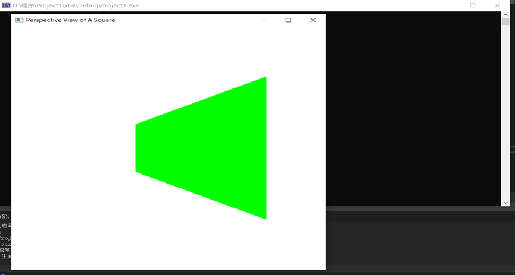
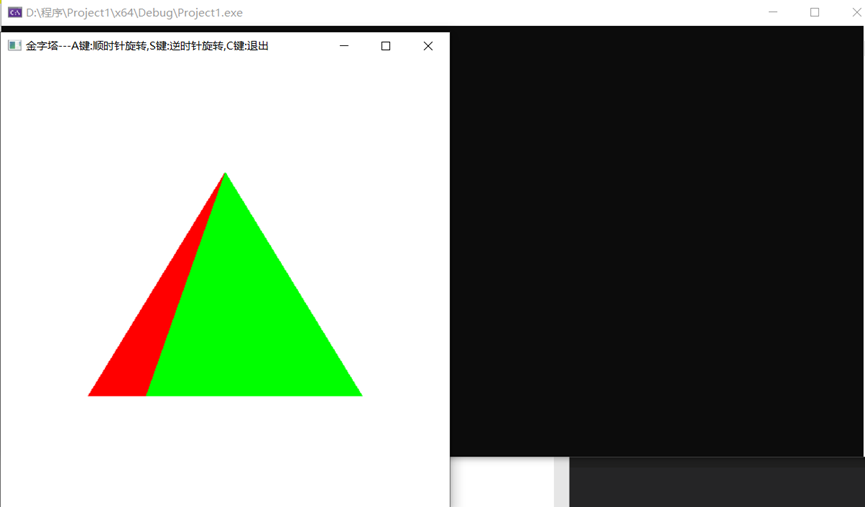

1. 本次实验任务是完成三维观察实验，文件exp12_1通过代码实现了对三维立体图形进行投影变换的功能，关键代码如下：

   ```C++
   void displayFcn(void) {
       glClear(GL_COLOR_BUFFER_BIT);//清空颜色缓存
       glColor3f(0.0, 1.0, 0.0);//投用颜色为绿色
       glPolygonMode(GL_FRONT, GL_FILL);// 设置正面为填充方式
       glPolygonMode(GL_BACK, GL_LINE);// 设置反面为边缘绘制方式
       glBegin(GL_QUADS);//绘制四边形,以下是四边形的四个点
       glVertex3f(0.0, 0.0, 0.0);//
       glVertex3f(100.0, 0.0, 0.0);
       glVertex3f(100.0, 100.0, 0.0);
       glVertex3f(0.0, 100.0, 0.0);
       glEnd();
       glFlush();
   }
   ```

   文件exp12_2通过代码实现了绘制立体图形金字塔的投影图形并通过键盘上A、S、C三个按键分别代表顺时针旋转5度、逆时针旋转5度和退出的功能，关键代码如下：

   ```C++
   void drawPyramid() //该金字塔在以原点为中心，边长为2的立方体范围内
   {
   	glBegin(GL_TRIANGLES);
   	glColor3f(1.0f, 0.0f, 0.0f);	  //前面为红色		
   	glVertex3f(0.0f, 1.0f, 0.0f);	//前面三角形上顶点
   	glVertex3f(-1.0f, -1.0f, 1.0f);  //前面三角形左顶点
   	glVertex3f(1.0f, -1.0f, 1.0f);	//前面三角形右顶点	
   
   	glColor3f(0.0f, 1.0f, 0.0f);		//右面为绿色				
   	glVertex3f(0.0f, 1.0f, 0.0f);	//右面三角形上顶点			
   	glVertex3f(1.0f, -1.0f, 1.0f);	//右面三角形左顶点				
   	glVertex3f(1.0f, -1.0f, -1.0f);	 //右面三角形右顶点	
   
   	glColor3f(0.0f, 0.0f, 1.0f);		//背面为蓝色			
   	glVertex3f(0.0f, 1.0f, 0.0f);  //背面三角形上顶点				
   	glVertex3f(1.0f, -1.0f, -1.0f);	 //背面三角形左顶点
   	glVertex3f(-1.0f, -1.0f, -1.0f);	//背面三角形右顶点	
   
   	glColor3f(1.0f, 1.0f, 0.0f);		//左面为黄色			
   	glVertex3f(0.0f, 1.0f, 0.0f);	//左面三角形上顶点
   	glVertex3f(-1.0f, -1.0f, -1.0f);	//左面三角形左顶点
   	glVertex3f(-1.0f, -1.0f, 1.0f);	//左面三角形右顶点	
   	glEnd();
   	glBegin(GL_POLYGON);  //金字塔底面正方形
   	glColor3f(0.5f, 0.5f, 0.5f);  //底面为灰色
   	glVertex3f(-1.0f, -1.0f, 1.0f);
   	glVertex3f(1.0f, -1.0f, 1.0f);
   	glVertex3f(1.0f, -1.0f, -1.0f);
   	glVertex3f(-1.0f, -1.0f, -1.0f);
   	glEnd();
   }
   
   ```

2. 运行结果图：

   投影变换：

   

   金字塔三维观察：

   

3. 实验总结：

   本次实验完成了投影变换和三维观察两个实验，我学会了使用观察透视投影需要用到的变换矩阵，熟悉了三维观察相关内容、OpenGL中的观察变换函数、掌握OpenGL中的正交投影和透视投影、又巩固加深了基本三维图形绘制等知识点。