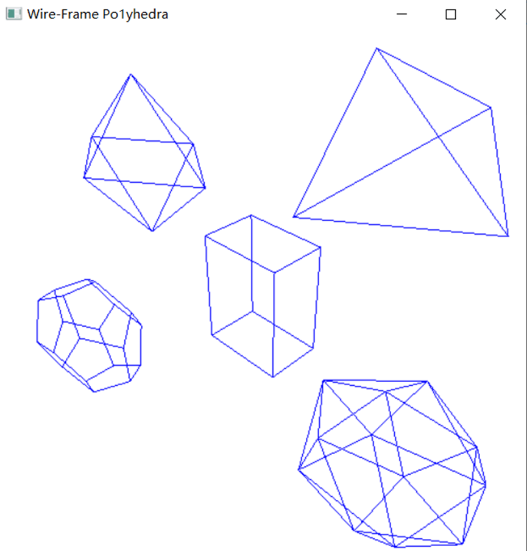
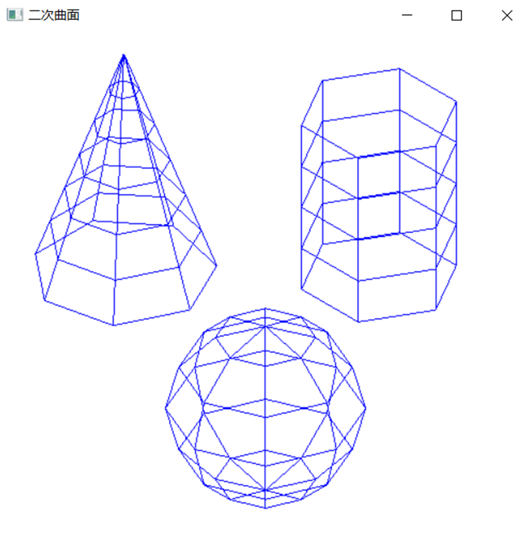

1. 本次实验完成了生成多面体线框图的实验，文件exp13_1通过代码实现了用GLUT柏拉图式实体的函数，生成多面体经过变换的透视线框显示，关键代码如下：

   ```C++
   void displayWirePolyhedra() {
       glClear(GL_COLOR_BUFFER_BIT);//清空颜色缓存
       glColor3f(0.0, 0.0, 1.0);
       gluLookAt(5.0, 5.0, 5.0, 0.0, 0.0, 0.0, 0.0, 1.0, 0.0);//定义视图矩阵
       glScalef(1.5, 2.0, 1.0);//模型缩放
       glutWireCube(1.0);//立方体线框
       glScalef(0.8, 0.5, 0.8);
       glTranslatef(-6.0, - 5.0, 0.0);
       glutWireDodecahedron();//十二面体线框
       glTranslatef(-3.0, -1.0, 0.0);
       glutWireOctahedron();//八面体线框
       glScalef(0.8, 0.8, 1.0);
       glTranslatef(4.3, -2.0, 0.5);
       glutWireIcosahedron();//二十面体线框
       glFlush();
   }
   ```

   文件13_2通过代码实现了通过GLUT和GLU二次曲面函数显示球面、圆锥面和圆柱面的线框图功能，关键代码如下：

   ```C++
   void wireQuadSurfs(void) {
       glClear(GL_COLOR_BUFFER_BIT);
       glColor3f(0.0, 0.0, 1.0);
       gluLookAt(2.0, 2.0, 2.0, 0.0, 0.0, 0.0, 0.0, 0.0, 1.0);//定义视图矩阵
       glPushMatrix();
       glTranslatef(1.0, 0.0, 0.0);
       glutWireSphere(0.75, 8, 6);//球面
       glPopMatrix();
       glPushMatrix();
       glTranslatef(1.0, -0.5, 0.5);
       glutWireCone(0.7, 2.0, 7, 6);//圆锥面
       glPopMatrix();
       GLUquadricObj* cylinder;
       glPushMatrix();
       glTranslatef(1.0, 1.2, 0.8);
       cylinder = gluNewQuadric();
       gluQuadricDrawStyle(cylinder, GLU_LINE);//圆柱面
       gluCylinder(cylinder, 0.6, 0.6, 1.5, 6, 4);
       glPopMatrix();
       glFlush();
   
   ```

2. 运行结果图：

   多面体透视线框：

   

   二次曲面线框：

   

3. 实验总结：

   本次实验完成的线框显示均是OpenGL中的GLUT和GLU里自带的显示函数，只是在调用函数前需要先指定观察方向，然后调用相应的图形显示线框的函数，例如显示规则的八面体线框需要调用gkutWireOctahedron()函数，生成球面需要调用glutWireSphere()函数，在使用时，要熟练掌握个函数的功能，才能画出想要的图形线框。