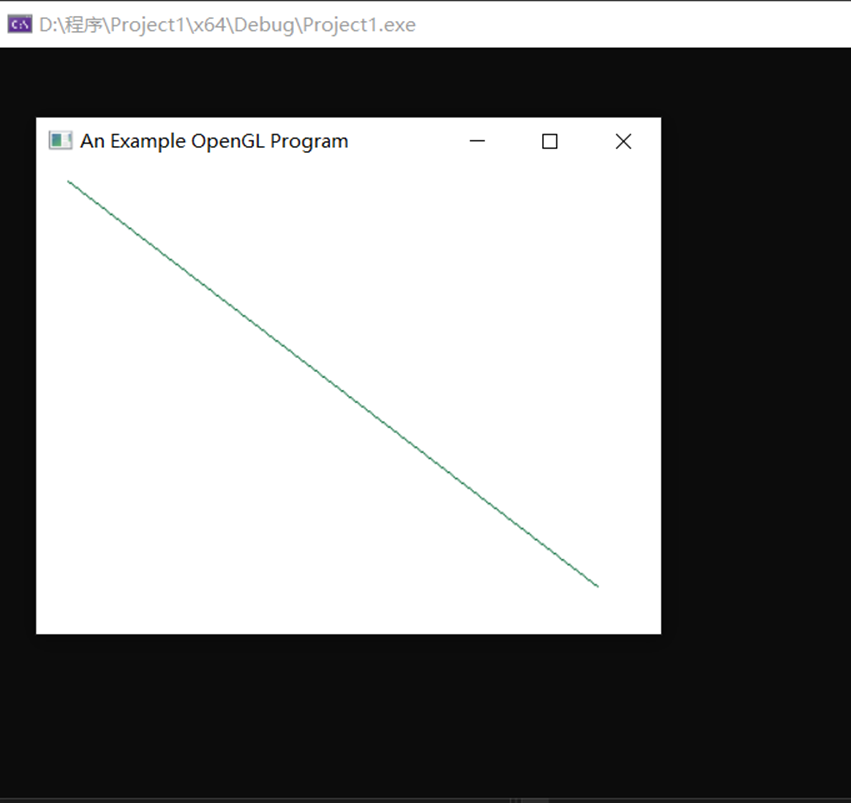

##### 实验一
1. 本次实验的任务是通过OPENGL示例程序生成直线段，文件exp1中的代码实现了通过两点确立一条直线的思想来生成了直线段的功能，关键代码如下
```c++
glBegin(GL_LINES);//指定线段几何形状的开始
	glVertex2i(180, 15);//设置直线段起点
	glVertex2i(10, 145);//设置直线段中点
glEnd();//几何形状的结束
```

2. 实验结果运行图如下

   

3. 实验总结：

   通过本次实验我明白了通过OPENBGL来画图时，颜色、窗口尺寸、窗口位置都可以通过调用相关库里的函数自定义设置，调用相关函数时必须把相关函数所在的库和头文件包含进来，否则将不能正常运行，本次实验是通过调用OPENGL自带的函数来实现的生成直线，但是效率低，并且直线不是很直。