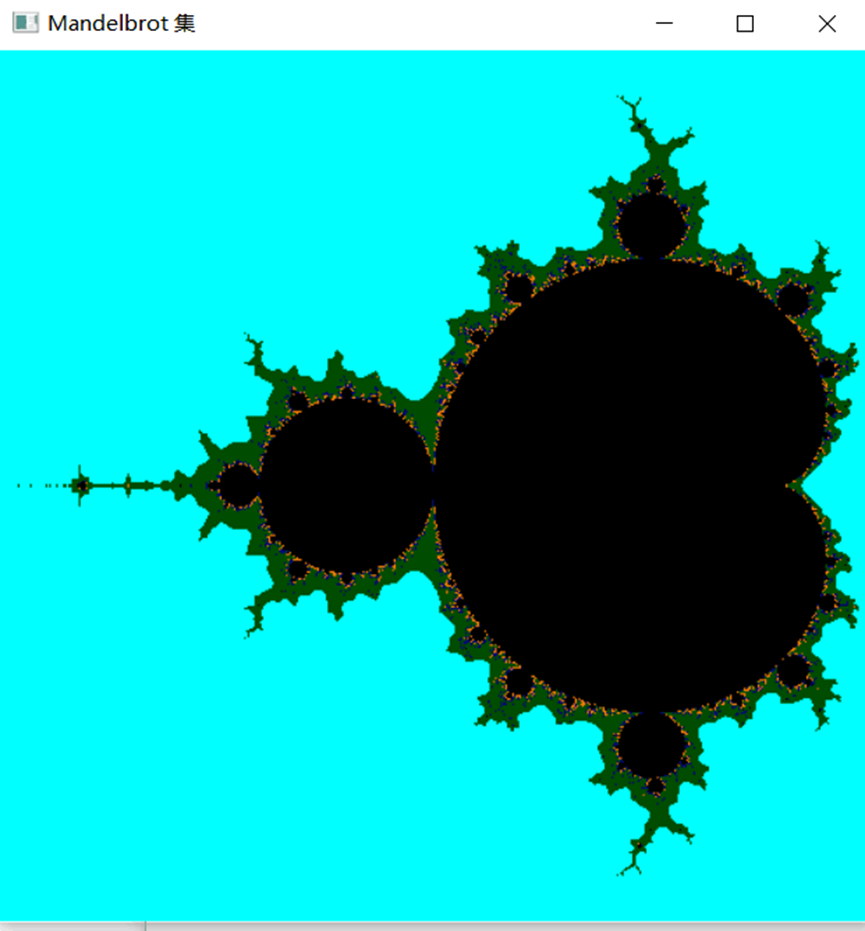

1. 本次实验任务是使用OpenGL，完成片元器着色实验，文件exp10_1通过代码验证了片元着色器算法，获得着色结果，关键代码如下：

   ```C++
   vec3 modNormal(vec3 point){//定义几何图元的顶点
       vec2 d0 = vec2(0,0.001);
       vec2 d1 = vec2(-0.000866,-0.0005);
       vec2 d2 = vec2(0.000866,-0.0005);
       vec2 p0=point +d0;
       vec2 p1=point +d1;
       vec2 p2==point +d2;
       float h0 = height(vec3(texture2D(textureID,p0)));
       float h1 = height(vec3(texture2D(textureID,p1)));
       float h2 = height(vec3(texture2D(textureID,p2)));
       vec3 v0=vec3(d0,h0);
       vec3 v1=vec3(d1,h1);
       vec3 v2=vec3(d2,h2);
       return normalize(vec3(cross(v1-v0,v2-v0)));
   
   }
   ```

   文件exp10_2通过代码实现了颜色编码建模建模实验的功能，关键代码如下：。 


2. 运行结果图如下：

   

3. 实验总结：

   片元着色器首先需要设置一个缓冲区对象，用于保存想要绘制的所有顶点的数据；实验二我熟悉并学会使用调用OpenGL函数完成颜色编码建模实验。