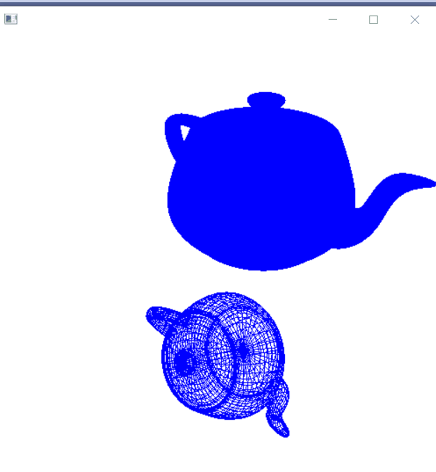

1. 本次实验任务是使用opengl，完成鼠标、键盘交互操作，文件exp11通过代码实现了画出茶壶并且通过键盘输入旋转轴和转转角度对茶壶进行旋转的功能，关键代码如下：

   ```C++
   void displayWirePolyhedra(float x, float y, float z, float thera) {
   	glClear(GL_COLOR_BUFFER_BIT);
   	glColor3f(0.0, 0.0, 1.0);
   	gluLookAt(5.0, 5.0, 5.0, 0.0, 0.0, 0.0, 0.0, 1.0, 0.0);
   	glScalef(1.0, 1.0, 1.0);
   	glTranslatef(1.0, 2.0, 0.0);//下一个图形坐标
   	glutSolidTeapot(1.5);
   	//glutWireTeapot(1.5);//放大倍数
   	glScalef(1.0, 1.0, 1.0);//缩放比
   	glTranslatef(-1.0, -5.0, 0.0);//下一个图形坐标
   
   	glRotatef(thera, x, y, z);
   	glutWireTeapot(1.5);
   	//glutSolidTeapot(2.0);
   	glFlush();
   }
   
   ```

2. 运行结果图：

   

3. 实验总结：

   通过本次实验，我熟悉了OpenGL中通过鼠标和键盘对图形的操作原理，实验完成了茶壶绕着某一坐标轴旋转指定度数的实验，虽然代码是老师给出的，但是在运行时却出现了一些错误，通过这些错误我也明白了在OpenGL中如果要使用输入输出时，要使用scanf_s()和print_f()函数，而不是scanf和printf，否则将不能运行，并且不同电脑的配置也会导致结果的不一样，虽然一样的代码。