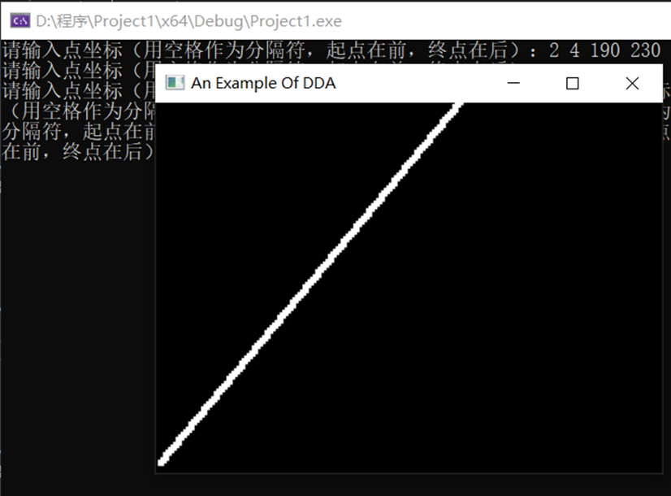

##### 实验二

1. 本次实验的任务是通过DDA算法生成直线段，文件exp2中的代码实现了通过键盘输入直线起点坐标和终点坐标的方式用DDA算法生成直线段的功能,DDA算法关键代码如下：其中x0，y0为起点坐标，xEnd和yEnd为终点坐标

   ```c++
   void lineDDA(int x0, int y0, int xEnd, int yEnd)
   {
   	int dx = xEnd - x0, dy = yEnd - y0, steps, k;
   	float xIncrement, yIncrement, x = x0, y = y0;
   	if  (fabs(dx) > fabs(dy))
   		steps = fabs(dx);
   	else
   		steps = fabs(dy);
   	xIncrement = float(dx) / float(steps);
   	yIncrement = float(dy) / float(steps);
   	setPixel(round(x), round(y));//由于每次都加了小于1的增量，所以需要取整
   	for (k = 0; k < steps; k++) {
   		x += xIncrement;
   		y += yIncrement;
   		setPixel(round(x), round(y));
   	}
   	return;
   	
   }
   ```

2. 实验运行结果图如下：

   

3. 实验总结：

   直线是图形中最基本的元素，DDA算法是基于数学的微分思想的直线生成算法，其基本原理$\frac{dy}{dx}=\frac{△y}{△x}=\frac{y1-y0}{x1-x0}$，由此得到$xi+1=xi+ε·△x，yi+1=yi+ε·△y,ε=\frac{1}{max(|△x|，|△y|)}$是通过本次实验，进一步巩固了我的程序设计能力和OPENGL图形库使用能力，以及图形生成直线算法的理解和掌握。

   

   