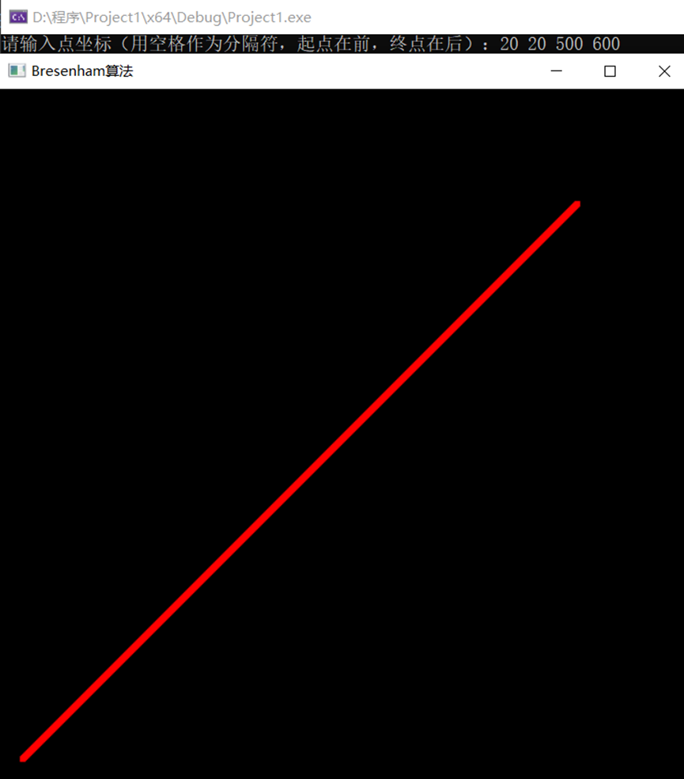
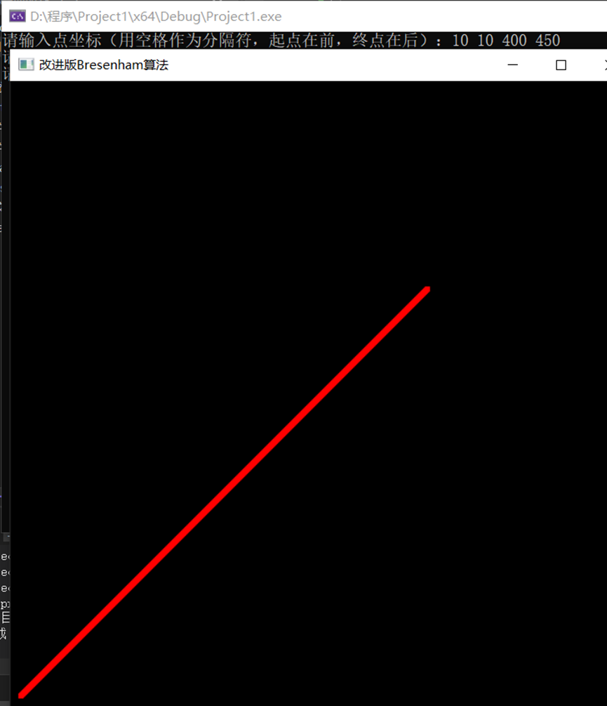

##### 实验三

1. 本次实验的任务是通过Bresenham、 改进Bresenham算法生成直线段，文件exp3_1中的代码实现了通过键盘输入直线段起点坐标和终点坐标，用Bresenham算法来实现对直线段的绘制关键代码如下：

   ```C++
   void lineBresenham(int x0,int y0,int xEnd,int yEnd) {
   	int dx = fabs(xEnd - x0), dy = fabs(yEnd - y0);
   	int p = 2 * dy - dx;
   	int twoDy = 2 * dy, twoDyMinusDx = 2 * (dy - dx);
   	int x, y;
   	if (x0 > xEnd) {
   		x = xEnd;
   		y = yEnd;
   		xEnd = x0;
   	}
   	else {
   		x = x0;
   		y = y0;
   	}
   	setPixel(x, y);
   	while (x < xEnd) {
   		x++;
   		if (p < 0)
   			p += twoDy;
   		else {
   			y++;
   			p += twoDyMinusDx;
   		}
   		setPixel(x, y);
   	}
   
   }
   
   ```

   文件exp3_2通过代码实现了改进的Bresenham算法，改进的Bresenham算法绘制直线段的关键代码如下：

   ```C++
   void proBresenhamLine(int x0, int y0, int x1, int y1)
   {
   	int dx, dy, e, x, y;
   	dx = x1 - x0; dy = y1 - y0;
   	e = -dx;
   	x = x0; y = y0;
   	while (x <= x1)
   	{
   		setPixel(x, y);
   		x++;
   		e = e + 2 * dy;
   		if (e > 0)
   		{
   			y++;
   			e = e - 2 * dx;
   		}
   	}
   }
   ```

2. Bresenham算法运行结果图如下所示：

   

   改进的Bresenham算法运行结果图如下所示：

   

3. 实验总结：

   通过本次实验，让我了解到了Bresenham算法实现的具体过程，把算法原理弄明白，其算法原理是将直线方程写为隐函数形式，即F(x,y)=y-kx-b=0,其中k为直线斜率，该方程将平面划分为三个区域：

   - 点在直线上，F（x,y)=0
   - 点在直线上方，F（x,y)>0
   - 点在直线下方，F（x,y)<0

   Bresenham算法采用递推步进的方法，令每次最大变化方向的坐标进一个像素同时另一个方向的坐标依据上述误差判别式的符号来决定是否也要进一个像素误差判别式代入的点为两个候选点的中点坐标，因此该算法也称之为中点算法，递推公式为初值d0=0.5-k，若d<0，则(x,y)更新为(x+1,y+1)，d更新为d+1-k，否则(x,y)更新为(x+1,y)，d更新为d-k；因为表达式中含有浮点数计算，因此改进的Bresenham算法就是基于此，用2d△x代替d，初值计算为d=△x-2△y，若d<0，则(x,y)更新为(x+1,y+1)，d更新为   d+2△x-2△y；否则(x,y)更新为(x+1,y), d更新为d-2△y。本次实验，让我同时时对Brensenham 算法生成线的过程和特点也有个更进一步的学习和掌握，并且也对openGL的强大功能有个初步的了解与认识。

