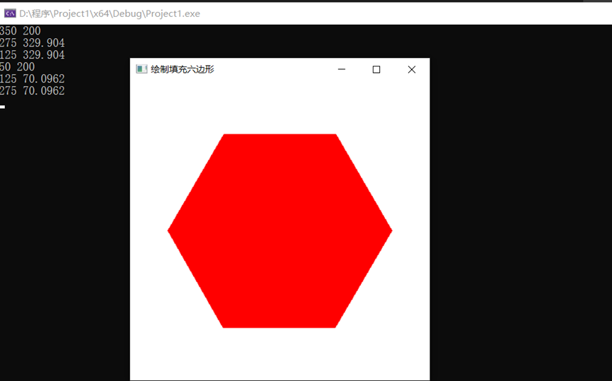
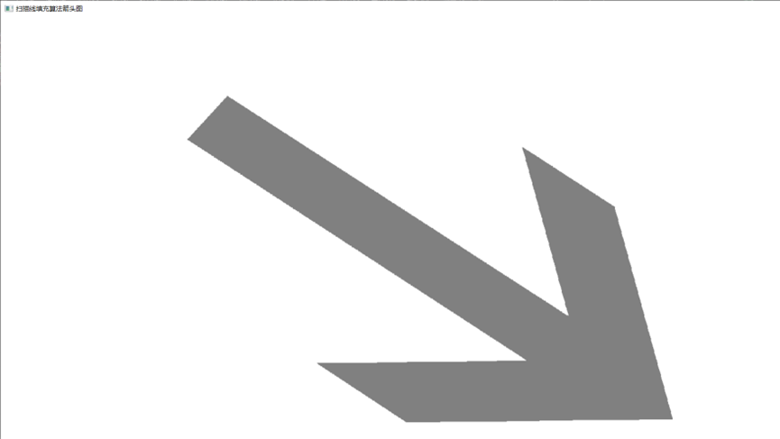

##### 实验四

1. 本次实验任务是填充算法的实验，文件exp4_1通过代码实现了对课本上P66六边形的填充功能，关键代码如下：该代码实现了正六边形的填充，并且六边形的位置不受显示窗口尺寸的任何改变的影响

   ```C++
   void init(void)
   {
   	screenPt hexVertex, circCtr;
   	GLdouble theta;
   	GLint k;
   	glClearColor(1.0f, 1.0f, 1.0f, 0.0f);//设置显示窗口颜色为白色
   	circCtr.setCoords(winWidth / 2, winHeight / 2);
   	regHex = glGenLists(1);
   	glNewList(regHex, GL_COMPILE);
   	glColor3f(1.0, 0.0, 0.0);
   	glBegin(GL_POLYGON);
   	for (k = 0; k < 6; k++)
   	{
   		theta = TWO_PI * k / 6.0;
   		hexVertex.setCoords(circCtr.getx() + 150 * cos(theta), circCtr.gety() + 150 * sin(theta));
   		std::cout << circCtr.getx() + 150 * cos(theta) << ' ' << circCtr.gety() + 150 * sin(theta) << std::endl;
   		glVertex2i(hexVertex.getx(), hexVertex.gety());
   	}
   	glEnd();
   	glEndList();
   }
   
   ```

   文件exp4_2通过代码实现了扫描线填充算法，关键代码如下：
   
   ```C++
   void polygonScan()
   {
     int maxY = 0;//计算最高点的y坐标
     for (int i=0; i<vertices.size(); i++)
     {
       if (vertices[i].y > maxY)
       {
         maxY = vertices[i].y;
       }
     }
       //初始化ET和AET
     Edge *pET[windowHeight];
     for (int i=0; i<maxY; i++)
     {
       pET[i] = new Edge();
       pET[i]->next = nullptr;
     }
     AET = new Edge();
     AET->next = nullptr;
     //清空显示窗口并设置画点颜色为灰色
     glClear(GL_COLOR_BUFFER_BIT);
     glColor3f(0.5,0.5,0.5);
     glBegin(GL_POINTS);
     //建立边表ET
     for (int i=0; i<vertices.size(); i++)
     {
       //取出当前点1前后相邻的共4个点，点1与点2的连线作为本次循环处理的边，另外两个点点0和点3用于计算奇点
       int x0 = vertices[(i - 1 + vertices.size()) % vertices.size()].x;
       int x1 = vertices[i].x;
       int x2 = vertices[(i + 1) % vertices.size()].x;
       int x3 = vertices[(i + 2) % vertices.size()].x;
       int y0 = vertices[(i - 1 + vertices.size()) % vertices.size()].y;
       int y1 = vertices[i].y;
       int y2 = vertices[(i + 1) % vertices.size()].y;
       int y3 = vertices[(i + 2) % vertices.size()].y;
       //水平线直接舍弃
       if (y1 == y2)
         continue;
       //分别计算下端点y坐标、上端点y坐标、下端点x坐标和斜率倒数
       int ymin = y1 > y2 ? y2 : y1;
       int ymax = y1 > y2 ? y1 : y2;
       float x = y1 > y2 ? x2 : x1;
       float dx = (x1 - x2) * 1.0f / (y1 - y2);
       //奇点特殊处理，若点2->1->0的y坐标单调递减则y1为奇点，若点1->2->3的y坐标单调递减则y2为奇点
       if (((y1 < y2) && (y1 > y0)) || ((y2 < y1) && (y2 > y3)))
       {
         ymin++;
         x += dx;
       }
       //创建新边，插入边表ET
       Edge *p = new Edge();
       p->ymax = ymax;
       p->x = x;
       p->dx = dx;
       p->next = pET[ymin]->next;
       pET[ymin]->next = p;
     }
     //扫描线从下往上扫描，y坐标每次加1
     for (int i=0; i<maxY; i++)
     {
       //取出ET中当前扫描行的所有边并按x的递增顺序（若x相等则按dx的递增顺序）插入AET
       while (pET[i]->next)
       {
         //取出ET中当前扫描行表头位置的边
         Edge *pInsert = pET[i]->next;
         Edge *p = AET;
         //在AET中搜索合适的插入位置
         while (p->next)
         {
           if (pInsert->x > p->next->x)
           {
             p = p->next;
             continue;
           }
           if (pInsert->x == p->next->x && pInsert->dx > p->next->dx)
           {
             p = p->next;
             continue;
           }
           //找到位置
           break;
         }
         //将pInsert从ET中删除，并插入AET的当前位置
         pET[i]->next = pInsert->next;
         pInsert->next = p->next;
         p->next = pInsert;
       } 
       //AET中的边两两配对并填色
       Edge *p = AET;
       while (p->next && p->next->next)
       {
         for (int x = p->next->x; x < p->next->next->x; x++)
         {
           glVertex2i(x, i);
         }
         p = p->next->next;
       }  
       //删除AET中满足y=ymax的边
       p = AET;
       while (p->next)
       {
         if (p->next->ymax == i)
         {
           Edge *pDelete = p->next;
           p->next = pDelete->next;
           pDelete->next = nullptr;
           delete pDelete;
         }
         else
         {
           p = p->next;
         }
       }  
       //更新AET中边的x值，进入下一循环
       p = AET;
       while (p->next)
       {
         p->next->x += p->next->dx;
         p = p->next;
       }     
     }
     glEnd();
     glFlush();
   }
   ```

2. 运行结果图：

   六边形填充：

   

   扫描算法：

   

3. 实验总结：

   本次实验完成了课本上的的六边形填充实验和扫描线填充算法两个实验，使我明白了通过OPENGL画图的显示窗口可以重定形，并且可以设置，并且可以使图形位置不随显示窗口的变化而变化，并且也熟悉掌握了扫描线填充算法的基本思想：用水平扫描线从上到下（或从下到上） 扫描由多条首尾相连的线段构成的多边形，每根扫描线与多边形的某 些边产生一系列交点。将这些交点按照x坐标排序，将排序后的点两 两成对，作为线段的两个端点，以所填的颜色画水平直线。多边形被 扫描完毕后，颜色填充也就完成了。扫描线填充算法也可以归纳为以 下4个步骤： 

   （1） 求交，计算扫描线与多边形的交点 
    （2） 交点排序，对第2步得到的交点按照x值从小到大进行排序； 
    （3） 颜色填充，对排序后的交点两两组成一个水平线段，以画线段
    的方式进行颜色填充； 
    （4） 是否完成多边形扫描？如果是就结束算法，如果不是就改变扫
    描线，然后转第1步继续处理； 

​	