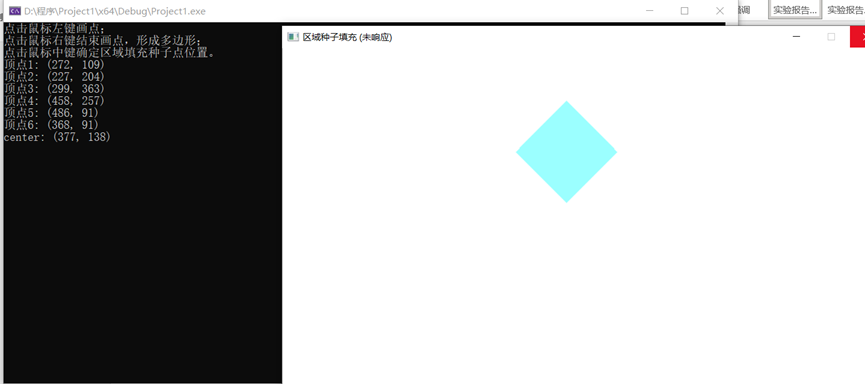

1. 本次实验任务是完成圆扫描转换和种子点填充实验，文件exp5_1通过代码完成了圆的扫描转换功能，需要手动输入圆的半径，关键代码如下：

   ```C++
   void  plot_circle_points(int xc, int yc, int x, int y)//八分法画圆
   {
   	glBegin(GL_POINTS);
   	glVertex3f(xc + x, yc + y, 0);
   	glVertex3f(xc - x, yc + y, 0);
   	glVertex3f(xc + x, yc - y, 0);
   	glVertex3f(xc - x, yc - y, 0);
   	glVertex3f(xc + y, yc + x, 0);
   	glVertex3f(xc - y, yc + x, 0);
   	glVertex3f(xc + y, yc - x, 0);
   	glVertex3f(xc - y, yc - x, 0);
   	glEnd();
   }
   void drawcircle(int xc, int yc, int radius)//中点Bresenham画圆算法
   {
   	int x, y, p;
   	x = 0;
   	y = radius;
   	p = 3 - 2 * radius;
   	glClear(GL_COLOR_BUFFER_BIT);
   	glBegin(GL_POINTS);
   	while (x < y)
   	{
   		plot_circle_points(xc, yc, x, y);
   		if (p < 0)
   			p = p + 4 * x + 6;
   		else
   		{
   			p = p + 4 * (x - y) + 10;
   			y -= 1;
   		}
   		x += 1;
   	}
   	if (x == y)
   		plot_circle_points(xc, yc, x, y);
   }
   ```

   文件exp5_2通过代码实现了种子填充算法，需要手动输入种子点位置，本程序加深了难度，不用手动输入种子点，只需要用鼠标点击种子点位置即可，关键代码如下：

   ```C++
   //用队列queue实现的 4连通区域的填充算法
   void BoundaryFill4(int x, int y)
   {
   	queue<point> q;
   	q.push(point(x, y));
   	while (!q.empty())
   	{
   		point now = q.front();
   		q.pop();
   		int nowx = now.x, nowy = now.y;
   		float color[3];
   		glReadPixels(nowx, nowy, 1, 1, GL_RGB, GL_FLOAT, color); //读取像素颜色
   		if (!is_equal(color, newcolor) && !is_equal(color, boundarycolor))
   		{
   			draw_a_point(nowx, nowy);
   			q.push(point(nowx, nowy + 1)); //下方
   			q.push(point(nowx, nowy - 1));
   			q.push(point(nowx + 1, nowy));
   			q.push(point(nowx - 1, nowy)); //左方
   		}
   	}
   }
   
   ```

2. 运行结果图如下：

   圆的扫描转换：

   区域种子点填充算法：

   

   

   ​		

3. 实验总结：

   通过本次实验我明白了常用的画圆方法是八分法画圆，只需要确定一个象限一半的圆即可画出全部圆，该画圆方法需要结合Bresenham画圆算法找出像素点一起使用；种子点填充算法的思路是，所有的种子点填充算法的核心其实就是一个递归算法，都是从指定的种子点开始，向各个方向搜索，逐个像素进行处理，直到遇到边界，各个种子填充算法只是在处理颜色和边界的方式上有所不同，搜索方式常见的有四邻接点和八邻接点，本实验采用了四邻接点搜索然后根据种子点填充四连通区域；本次实验的两个内容都是需要先理解算法思想，把算法思想理解清楚了才能写出相应程序。

   

