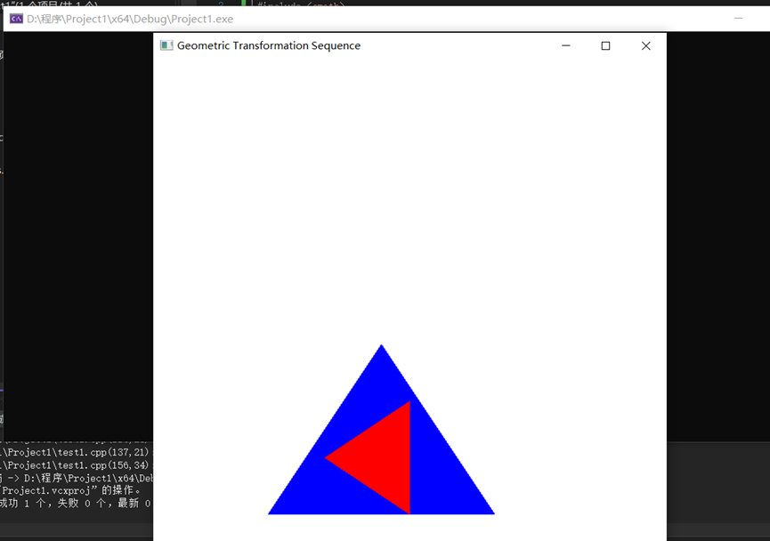

1. 本次实验任务是完成二维几何变换实验，文件exp6通过代码实现了对指定点坐标的三角形的平移、比例、旋转、对称，关键代码如下：

   ```C++
   void matrix3x3PreMultiply(Matrix3x3 m1, Matrix3x3 m2) {//完成矩阵乘法运算
       GLint row, col;
       Matrix3x3 matTemp;
       for (row = 0; row < 3; row++) {
           for (col = 0; col < 3; col++) {
               matTemp[row][col] = m1[row][0] * m2[0][col] + m1[row][1] * m2[1][col] + m1[row][2] * m2[2][col];
           }
       }
       for (row = 0; row < 3; row++) {
           for (col = 0; col < 3; col++) {
               m2[row][col] = matTemp[row][col];
           }
       }
   
   }
   
   void translate2D(GLfloat tx, GLfloat ty) {//平移矩阵构造函数
       Matrix3x3 matTrans1;
   
       matrix3x3SetIdentity(matTrans1);
   
       matTrans1[0][2] = tx;
       matTrans1[1][2] = ty;
   
       matrix3x3PreMultiply(matTrans1, matComposite);
   }
   
   void rotate2D(wcPt2D pivotPt, GLfloat theta) {//旋转矩阵构造函数
       Matrix3x3 matRot;
       matrix3x3SetIdentity(matRot);
       matRot[0][0] = cos(theta);
       matRot[0][1] = -sin(theta);
       matRot[0][2] = pivotPt.x * (1 - cos(theta)) + pivotPt.y * sin(theta);
       matRot[1][0] = sin(theta);
       matRot[1][1] = cos(theta);
       matRot[1][2] = pivotPt.y * (1 - cos(theta)) - pivotPt.x * sin(theta);
       matrix3x3PreMultiply(matRot, matComposite);
   }
   
   void scale2D(GLfloat sx, GLfloat sy, wcPt2D fixedPt) {//缩放矩阵构造函数
       Matrix3x3 matScale;
       matrix3x3SetIdentity(matScale);
   
       matScale[0][0] = sx;
       matScale[0][2] = (1 - sx) * fixedPt.x;
       matScale[1][1] = sy;
       matScale[1][2] = (1 - sy) * fixedPt.y;
   
       matrix3x3PreMultiply(matScale, matComposite);
   }
   
   void transformVerts2D(GLint nVerts, wcPt2D* verts) {//对称变换构造函数
       GLint k;
       GLfloat temp;
       for (k = 0; k < nVerts; k++) {
           temp = matComposite[0][0] * verts[k].x + matComposite[0][1] * verts[k].y + matComposite[0][2];
           verts[k].y = matComposite[1][0] * verts[k].x + matComposite[1][1] * verts[k].y + matComposite[1][2];
           verts[k].x = temp;
       }
   }
   ```

2. 运行结果图为：

   

3. 实验总结：

   本次实验的内容都是通过给出对点的变换的公式，完成相应二维图形的变换，变换需要用到规范化齐次坐标，然后乘以相应的变换矩阵，编写程序时，要牢记变换矩阵中的四块区域分别对应哪一种变换功能，例如左上角对应平移旋转、缩放、错切，对称；实际上，对于复杂的图形都可以通过点的变换来完成，都可以由五种基本的变换来完成，通过对多个顶点进行变换，连接新顶点即可得到变换后的多边形。