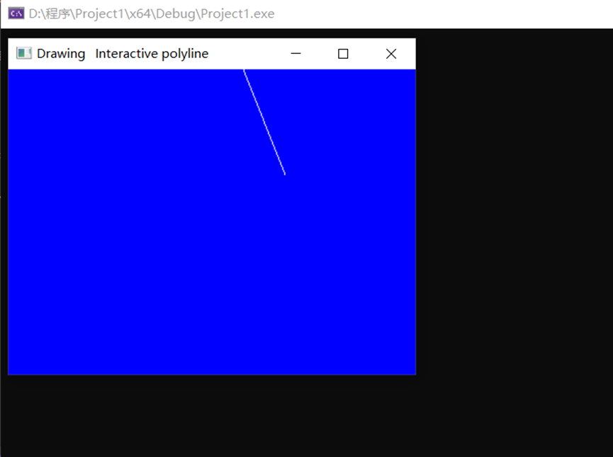
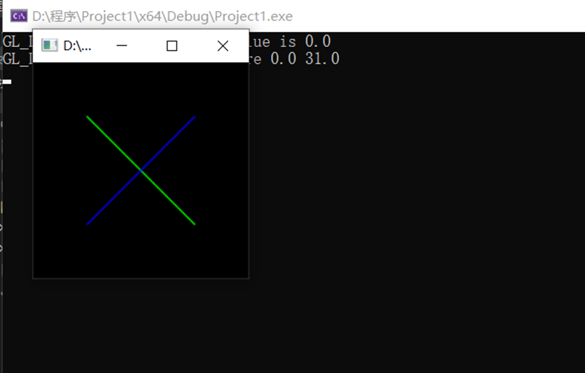

1. 本次实验任务是通过OPENGL里自带的GLUT鼠标函数，以及反走样技术完成相应的鼠标函数实验和反走样实验；exp7_1通过代码实现了在显示窗口点击鼠标左键可以在鼠标点击位置显示一个尺寸为3的红色点和用鼠标点击两个不同位置画直线，展示了交互构造一条折线的功能：红色点关键代码如下：

   ```C++
   void plotPoint(GLint x, GLint y) {//为鼠标点击点着色
       glBegin(GL_POINTS);
       glVertex2i(x, y);
       glEnd();
   }
   void mouseptPlot(GLint button, GLint action, GLint x, GLint y) {//当鼠标点击为左键并且处于按下状态调用函数
       if (button == GLUT_LEFT_BUTTON && action == GLUT_DOWN) {
           plotPoint(x, y);
       }
       glFlush();
   }
   ```

   交互构造折线关键代码如下：

   ```C++
   void drawLineSegment(scrpt s1, scrpt s2) {//通过鼠标点击的两个位置的点坐标来确定直线段
       glBegin(GL_LINES);
       glVertex2i(s1.x, s1.y);//起点
       glVertex2i(s2.x, s2.y);//终点
       glEnd();
   }
   //首先只能通过鼠标左键来确立直线段，鼠标右键结束程序，即用鼠标左键在显示窗口的两个位置画出直线段，之后可以可以选择新的位置来和上一个点确立新的直线段
   void polyline(GLint button, GLint action, GLint xMouse, GLint yMouse) {
       static scrpt endpt1, endpt2;
       if (endPtCtr == 0) {
           if (button == GLUT_LEFT_BUTTON && action == GLUT_DOWN) {
               endPtCtr = 1;
               endpt1.x = xMouse;
               endpt1.y = winHeight - yMouse;
           }
           else
               if (button == GLUT_RIGHT_BUTTON && action == GLUT_DOWN)
                   exit(0);
       }
       else
           if (button == GLUT_LEFT_BUTTON && action == GLUT_DOWN) {
               endpt2.x = xMouse;
               endpt2.y = yMouse;
               drawLineSegment(endpt1, endpt2);
               endpt1 = endpt2;
           }
           else
               if (button == GLUT_RIGHT_BUTTON)
                   exit(0);
       glFlush();
   }
   ```

   文件exp7_2通过代码实现了用反走样消除走样的功能，关键代码如下：

   ```C++
   void init(void)
   {
   	GLfloat values[2];
   	glGetFloatv(GL_LINE_WIDTH_GRANULARITY, values);//反锯齿线的相邻支持宽度之间的宽度差
   	printf("GL_LINE_WIDTH_GRANULARITY value is %3.1f\n", values[0]);
   
   	glGetFloatv(GL_LINE_WIDTH_RANGE, values);//抗锯齿线支持的最小宽度和最大宽度
   	printf("GL_LINE_WIDTH_RANGE values are %3.1f %3.1f\n", values[0], values[1]);
   
   	glEnable(GL_LINE_SMOOTH);//激活OpenGL中的反走样程序，正确的筛选绘制线条
   	glEnable(GL_BLEND);//将传入的 RGBA 颜色值与颜色缓冲区中的值混合
   	glBlendFunc(GL_SRC_ALPHA, GL_ONE_MINUS_SRC_ALPHA);//实现透明度和RGB颜色值
   	glHint(GL_LINE_SMOOTH_HINT, GL_DONT_CARE);//指示抗锯齿线的采样质量
   
   	glLineWidth(1.5);//指定光栅化线的宽度
   
   	glClearColor(0.0, 0.0, 0.0, 0.0);
   }
   ```

2. 运行结果图：

   鼠标函数：

   

   

   反走样：直线反走样

   

3. 实验总结：

   通过本次GLUT鼠标函数实验，我认识到了OPENGL库里包含一些控制鼠标点击事件的函数，GLUT已经为我们的注册好了函数，只要我们提供一个方法。使用函数glutMouseFunc,就可以帮我们注册我们的函数，这样当发生鼠标事件时就会自动调用我们的方法。我们要绘制的图形在理论上是连续的，例如直线，但是屏幕显示设备却是由像素组成的离散形式，当在二维屏幕上显示连续的像素点时，总是会出现失真现象，绘制的物体边缘部分出现锯齿的现象称之为走样(aliasing)，用于减轻或者消除这种图形失真现象的技术称之为反走样(Anti-aliasing)，Open中提供了强大的库函数功能帮我们消除走样，要熟练掌握并会运用各种函数，OpenGL反走样本身也是一个比较复杂的主题，深入了解需要有信号处理中的背景知识，例如信号采样、信号重构、滤波等知识。