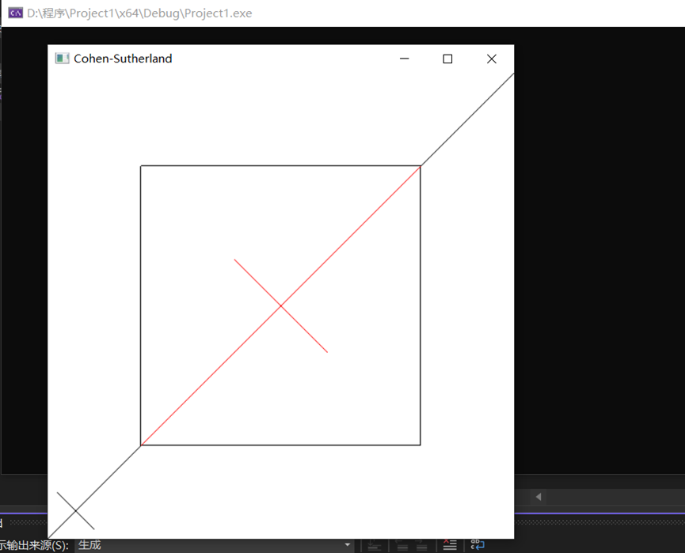
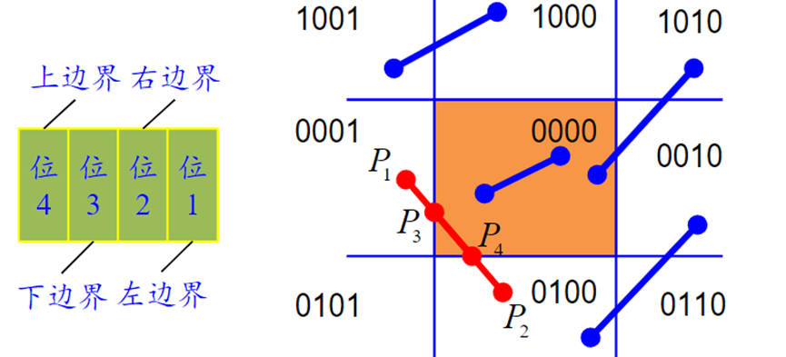

1. 本次实验任务是通过使用opengl，用Cohen-Sutherland线段裁剪算法对直线段进行裁剪，文件exp8中的代码验证了Cohen-Sutherland裁剪算法，实现了从键盘输入任意的直线段，用指定的裁剪窗口裁剪直线段的功能，关键代码如下：

   ```C++
   void lineClipCohSuth(wcPt2D winMin, wcPt2D winMax, wcPt2D p1, wcPt2D p2) {
       GLubyte code1, code2;
       GLint done = false, plotLine = false;
       GLfloat m;
       while (!done) {
           code1 = encode(p1, winMin, winMax);
           code2 = encode(p2, winMin, winMax);
           if (accept(code1, code2)) {
               done = true;
               plotLine = true;
           }
           else if (reject(code1, code2)) {
               done = true;
           }
           else {
               if (inside(code1)) {
                   swapPts(&p1, &p2);
                   swapCodes(&code1, &code2);
               }
               if (p2.x != p1.x) m = (p2.y - p1.y) / (p2.x - p1.x);
               if (code1 & winLeftBitCode) {
                   p1.y += (winMin.x - p1.x) * m;
                   p1.x = winMin.x;
               }
               else if (code1 & winRightBitCode) {
                   p1.y += (winMax.x - p1.x) * m;
                   p1.x = winMax.x;
               }
               else if (code1 & winBottomBitCode) {
                   if (p2.x != p1.x)
                       p1.x += (winMin.y - p1.y) / m;
                   p1.y = winMin.y;
               }
               else if (code1 & winTopBitCode) {
                   if (p2.x != p1.x)
                       p1.x = (winMax.y - p1.y) / m;
                   p1.y = winMax.y;
               }
           }
       }
       if (plotLine)
           glBegin(GL_LINES);
       glLineWidth(10);
       glColor3f(1, 0, 0);
       glVertex2f(p1.x, p1.y);
       glVertex2f(p2.x, p2.y);
       glEnd();
   }
   ```

2. 运行结果图为：

   结果说明：红色线段为裁剪后简取之的线段，黑色为简弃之的线段

   

3. 实验总结:

   裁剪是从数据集合提取信息的过程，它是计算机图形学许多重要问题的基础。裁剪典型的用途就是从一个大的场景中提取所需的信息，以显示某一局部场景或视图。比如浏览地图时，对感兴趣的区域放大显示，此时窗口内显示的内容会相应减少。确定图形的哪些部分在窗口内，哪些部分在窗口外（不可见区域），只显示窗口内的那部分图形，这个选择处理过程就是裁剪。在裁剪算法中，Cohen-Sutherland算法提出的直线端点的编码规则，我认为这个算法创新性很强。它通过简单的编码就可以实现对满足“简取”和“简弃”条件的直线段进行快速判断。Cohen-Sutherland算法的缺点在于需要计算直线和窗口的交点。

   **算法思想**
    1）若线段完全在窗口之内则显示该线段称为“取”，
    2）若线段明显在窗口之外则丢弃该线段称为“弃”
    3）若线段既不满足“取”的条件也不满足“弃”的条件则把线段分割为两段，对于完全在窗口之外的部分可弃之。

   **具体实现**
    为快速判断一条直线段与矩形窗口的位置关系采用如图所示的空间划分和编码方案（四位二进制编码上下右左）

   裁剪是从数据集合提取信息的过程，它是计算机图形学许多重要问题的基础。裁剪典型的用途就是从一个大的场景中提取所需的信息，以显示某一局部场景或视图。比如浏览地图时，对感兴趣的区域放大显示，此时窗口内显示的内容会相应减少。确定图形的哪些部分在窗口内，哪些部分在窗口外（不可见区域），只显示窗口内的那部分图形，这个选择处理过程就是裁剪。在裁剪算法中，Cohen-Sutherland算法提出的直线端点的编码规则，我认为这个算法创新性很强。它通过简单的编码就可以实现对满足“简取”和“简弃”条件的直线段进行快速判断。Cohen-Sutherland算法的缺点在于需要计算直线和窗口的交点。

   **算法思想**
    1）若线段完全在窗口之内则显示该线段称为“取”，
    2）若线段明显在窗口之外则丢弃该线段称为“弃”
    3）若线段既不满足“取”的条件也不满足“弃”的条件则把线段分割为两段，对于完全在窗口之外的部分可弃之。

   **具体实现**
    为快速判断一条直线段与矩形窗口的位置关系采用如图所示的空间划分和编码方案（四位二进制编码上下右左）
     

   裁剪一条线段时先求出两端点所在的区号，若皆为零保留。
    若端点编码按位取与运算的结果不为零，意味着线段位于窗口之外，应舍弃。 否则求出线段与窗口某边的交点并将该线段一分为二后，舍弃完全在窗口外的线段并对另一段重复上述处理。

