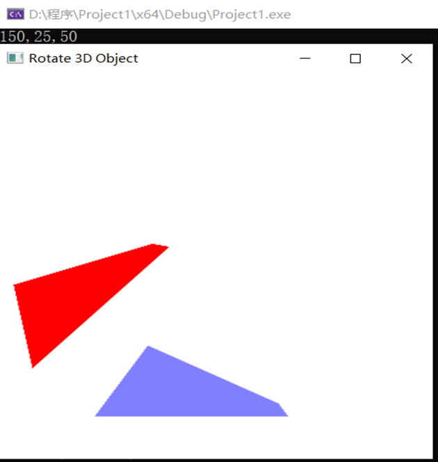

1. 本次实验任务是完成三维图形在OpenGL中几何变换的实验，文件exp9中代码实现了空间三角形旋转45度并平移的功能，角度可以指定，只不过在本程序中指定了45度为旋转角度，关键代码如下：

   ```C++
   void translate3D(GLfloat tx, GLfloat ty, GLfloat tz)
   {
   	/*通过偏移量tx,ty产生平移矩阵matTransl之后，再通过矩阵的乘法，实现对象的平移*/
   	Matrix4x4 matTransl;//平移矩阵
   	Matrix4x4SetIdentity(matTransl);
   	matTransl[0][3] = tx;
   	matTransl[1][3] = ty;
   	matTransl[2][3] = ty;
   	/*矩阵乘法，平移*/
   	matrix4x4Premultiply(matTransl, matComposite);
   }
   void rotate3d(wcPt3d p1, wcPt3d p2, GLfloat theta)
   {
   /*通过旋转角度theta产生旋转矩阵matRot之后，再通过矩阵的乘法，实现对象的旋转*/
   	Matrix4x4 matRot;//旋转矩阵
   	GLfloat axisVecLength = sqrt((p2.x - p1.x) * (p2.x - p1.x) + (p2.y - p1.y) * (p2.x - p1.x) + (p2.z - p1.z) * (p2.z - p1.z));
   	GLfloat cosTheta = cos(theta);
   	GLfloat oneC = 1 - cosTheta;
   	GLfloat sinTheta = sin(theta);
   	GLfloat ux = (p2.x - p1.x) / axisVecLength;
   	GLfloat uy = (p2.y - p1.y) / axisVecLength;
   	GLfloat uz = (p2.z - p1.z) / axisVecLength;
   
   	/*将旋转向量平移到原点*/
   	translate3D(-p1.x, -p1.y, -p1.z);
   	Matrix4x4SetIdentity(matRot);
   	matRot[0][0] = ux * ux * oneC + cosTheta;
   	matRot[0][1] = ux * uy * oneC - uz * sinTheta;
   	matRot[0][2] = ux * uz * oneC + uy * sinTheta;
   	matRot[1][0] = uy * uz * oneC + uz * sinTheta;
   	matRot[1][1] = uy * uy * oneC + cosTheta;
   	matRot[1][2] = uy * uz * oneC + uy * sinTheta;
   	matRot[2][0] = uz * ux * oneC - uy * sinTheta;
   	matRot[2][1] = uz * uy * oneC + ux * sinTheta;
   	matRot[2][2] = uz * uz * oneC + cosTheta;
   	matrix4x4Premultiply(matRot, matComposite);
   	translate3D(p1.x, p1.y, p1.z);//平移回原来的位置
   
   }
   
   
   ```

2. 运行结果图为：

   

3. 实验总结:

   本次实验我完成了三维图形在空间中旋转45度的效果，结果图中蓝紫色为原空间三角形在XOY平面上的投影，红色图形为旋转后的空间三角形在XOY面上的投影；通过OpenGL实现三维几何变换实际上是也是和二维几何变换类似，通过矩阵乘法来实现，无论是移动、旋转、对称、错切、投影还是缩放大小都是通过规范化的齐次坐标矩阵乘以相应变换对应的矩阵来实现，每一种变换都对应着单独的矩阵形式。